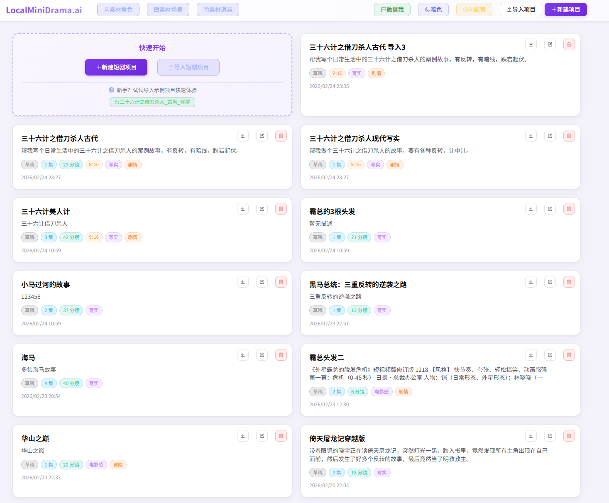
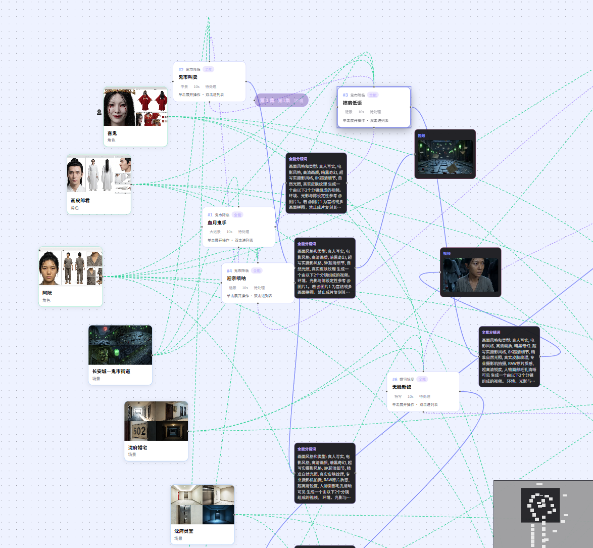
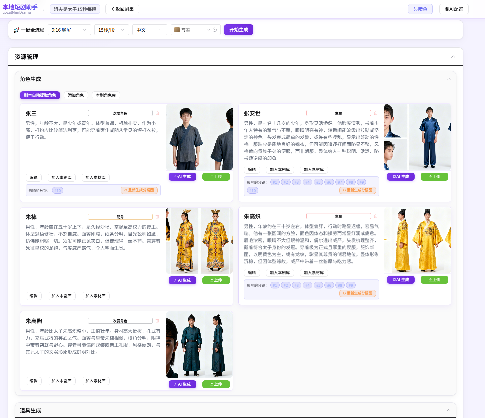
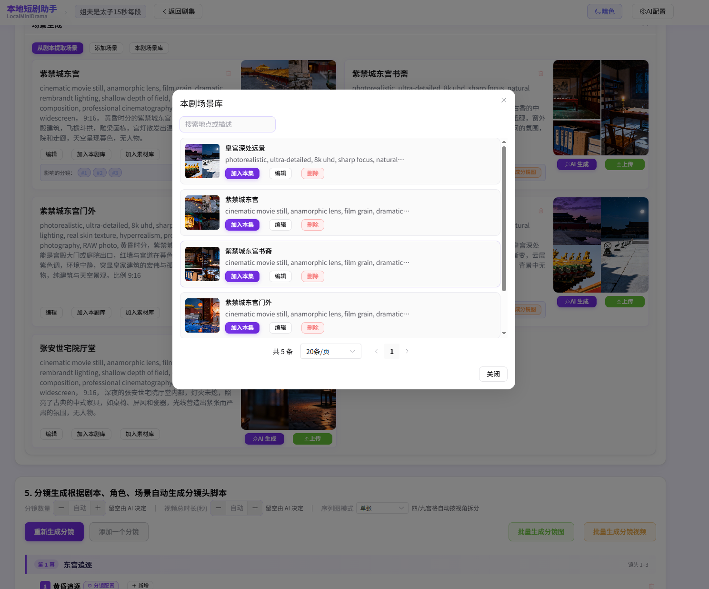

<div align="center">

# 🎬 本地短剧助手 · 修改版

**LocalMiniDrama 修改版 —— 本地 AI 短剧 & 漫剧生成工具，下载即用，数据不出本机**

*基于上游 [LocalMiniDrama](https://github.com/xuanyustudio/LocalMiniDrama) v1.2.8 二次开发*

[](https://github.com/kapone-systems/LocalMiniDrama/releases)
[](LICENSE)
[](#-快速开始)
[](#-项目架构)
[](https://github.com/kapone-systems/LocalMiniDrama/pulls)

**[English](docs/en.md) · 简体中文**

[](https://github.com/kapone-systems/LocalMiniDrama)

[**⬇️ 下载 Release**](https://github.com/kapone-systems/LocalMiniDrama/releases) · [**🚀 快速开始**](#-快速开始) · [**📖 配置 AI**](docs/configuration.md) · [**🗺 画布文档**](docs/plans/2026-06-15-drama-canvas-workflow-plan.md)

</div>

---

## ⚠️ 关于本仓库（请先阅读）

这是上游 LocalMiniDrama 的 **二次开发修改版**，不是原项目本身。与上游的区别：

| | 上游原项目 | 本仓库（修改版） |
|---|---|---|
| 仓库地址 | [xuanyustudio/LocalMiniDrama](https://github.com/xuanyustudio/LocalMiniDrama) | [kapone-systems/LocalMiniDrama](https://github.com/kapone-systems/LocalMiniDrama) |
| 下载方式 | 上游 Releases | **只从本仓库 [Releases](https://github.com/kapone-systems/LocalMiniDrama/releases) 下载** |
| grok2api 接入 | ❌ 无 | ✅ 图片 / 视频 / 文本协议 |
| 本地 ComfyUI | ❌ 无 | ✅ 直连本机 8188 生图 / 分镜图 / 视频 |
| 版本号 | 1.2.8 | 1.4.1 |

**重要：**

1. **下载请认准本仓库的 Releases**，不要使用原项目的下载链接——两者内容不同，版本也不互通。
2. 使用 grok2api 相关功能，需**自行部署 grok2api 服务**（上游项目：[chenyme/grok2api](https://github.com/chenyme/grok2api)），并配置到你自己的中转地址。协议对接细节见 [grok2api 契约文档](docs/grok2api-contract.md)，实测记录见 [验收文档](docs/grok2api-acceptance.md)。
3. **原版功能与上游下载请前往上游仓库**。本项目的原版功能全部来自上游，版权归原作者所有（MIT，见 [LICENSE](LICENSE)）。
4. 本项目的问题反馈请提交到[本仓库 Issues](https://github.com/kapone-systems/LocalMiniDrama/issues)。

---

<table>
<tr>
<td width="25%" align="center"><b>🔒 本地优先</b><br/>SQLite + 本地文件，素材不上云</td>
<td width="25%" align="center"><b>🎬 全流程</b><br/>剧本 → 角色/场景 → 分镜 → 视频合成</td>
<td width="25%" align="center"><b>🤖 多模型</b><br/>通义 / 火山 / 可灵 / Gemini 等</td>
<td width="25%" align="center"><b>🗺 双视图</b><br/>列表精细编辑 + 画布批量编排</td>
</tr>
</table>

市面上 AI 短剧工具不少，但真正能**本地离线运行、开箱即用、素材不上云**的几乎没有。  
本项目用纯 JavaScript 从零搭建，接入你自己的 AI API，打开即可生成完整 AI 短剧。

> ✅ 无订阅费 · ✅ 数据本地存储 · ✅ 支持多家 AI 服务商 · ✅ 完全开源可二次开发

---

## 📌 最新动态（v1.2.8）

- 🆕 **Agnes AI 接入**：文本 / 图片 / 视频一键配置，一个 Key 覆盖全流程
- 🆕 **画布模式增强**：剧本节点、右键菜单、浮动工具栏、画布内新建/删除/整集生成
- 🆕 **ModelArk 私有资产库**：SD2 角色认证对接火山方舟资产组，AK/SK 与 Bearer 双鉴权
- 🔧 **图床可配置**：`upload_url` / 超时（默认 180s）/ 重试次数写入 `config.yaml`；缓存 URL 失效自动重传
- 🔧 **提示词优化** · **分镜图片数量上限修复**

完整记录 → **[CHANGELOG.md](CHANGELOG.md)**

---

## 目录

- [界面预览](#-界面预览)
- [核心功能](#-核心功能)
- [快速开始](#-快速开始)
- [AI 服务商](#-ai-服务商支持)
- [项目架构](#-项目架构)
- [后续计划](#-后续计划-roadmap)
- [参与贡献](#-参与贡献)
- [联系社区](#-联系--社区)

---

## 📸 界面预览

<div align="center">
  <br/>
  <sub>首页 · 项目卡片一览，亮色模式</sub>
</div>

<br/>

<div align="center">
  <br/>
  <sub>🆕 画布模式 · 分镜流水线可视化 · 节点内编辑/生成 · 工作流整组重跑</sub>
</div>

<br/>

<table>
  <tr>
    <td align="center"><br/><sub>剧集管理 · 分集 + 资源库</sub></td>
    <td align="center"><br/><sub>分镜制作 · 图片 + 视频一键生成</sub></td>
  </tr>
  <tr>
    <td align="center"><br/><sub>角色生成 · AI 自动提取并生成角色形象图</sub></td>
    <td align="center"><br/><sub>分镜制作 · 专业视频参数（景别 / 运镜 / 灯光 / 景深）</sub></td>
  </tr>
  <tr>
    <td align="center" colspan="2"><br/><sub>场景库 · 一键「加入本集」，复用已有场景素材</sub></td>
  </tr>
</table>

---

## 🎬 AI 生成实拍效果

> 以下 3 段视频由**本软件自动工作流选择即梦 1.0**生成，展示连续分镜下角色外貌一致性。

<table>
  <tr>
    <td align="center">
      <video src="项目截图/1.mp4" controls width="300"></video><br/>
      <sub>分镜 1 · 即梦 1.0</sub>
    </td>
    <td align="center">
      <video src="项目截图/2.mp4" controls width="300"></video><br/>
      <sub>分镜 2 · 服装一致</sub>
    </td>
    <td align="center">
      <video src="项目截图/3.mp4" controls width="300"></video><br/>
      <sub>分镜 3 · 人物统一</sub>
    </td>
  </tr>
</table>

> 💡 同时支持火山 **Seedance 2.0**、通义万相、Vidu、可灵 Kling（含 Omni）等，模型越新效果通常越好。

---

## ✨ 核心功能

<details open>
<summary><b>🔄 完整创作流程（点击展开/收起）</b></summary>

| 步骤 | 功能 | 说明 |
|:----:|------|------|
| 1 | **故事生成** | 输入梗概 + 风格，AI 自动生成多集剧本 |
| 2 | **剧本编辑** | 分集管理，剧本文本可自由编辑 |
| 3 | **角色生成** | AI 提取角色列表，逐个生成角色形象图 |
| 4 | **场景生成** | 从剧本自动提取场景，生成场景背景图 |
| 5 | **道具生成** | 从剧本提取/手动添加道具，生成道具图 |
| 6 | **分镜生成** | 按集自动生成分镜脚本（含景别/运镜/台词） |
| 7 | **图片/视频生成** | 逐镜生成静帧图与视频片段 |
| 8 | **合成视频** | 所有分镜视频自动合成为完整剧集文件 |

</details>

<details>
<summary><b>⚡ 一键流水线 · 项目管理 · 分镜编辑</b></summary>

- **一键生成 / 补全并生成**：从角色到合成视频全自动；智能跳过已有内容
- **失败自动重试**：每步最多 3 次，应对限流；实时进度与错误日志
- **工程 ZIP 导出/导入** · **全局素材库** · **16:9 / 9:16 / 1:1 画幅**
- **经典 / 全能分镜** · **`@图片N` 多图参考** · **尾帧衔接** · **导出分镜表 HTML**
- **图片/视频提示词**全文编辑 · 手动上传/拖拽替换参考图

</details>

### 🗺 画布工作流（LibTV 式）

制作页 / 剧集详情 → **画布模式**（`/film/:id/canvas`），与列表模式**同源数据**：

| 能力 | 说明 |
|------|------|
| 竖排流水线 | 每镜一行：经典「文本→首帧/尾帧→视频」；全能「全能分镜词→视频」 |
| 剧本节点 | 画布起点直接编辑剧本、AI 生成故事、提取角色/场景/道具 |
| 节点操作面板 | 单击节点下方编辑/生成，无需频繁切列表 |
| 右键 / 工具栏 | 新建分镜、集、角色、场景、道具；框选创建工作流 |
| 工作流组 | 框选分镜 → 创建工作流 → **整组重跑**（生图/视频/配音可勾选） |
| 布局持久化 | 拖动保存坐标；曲线连线；左键框选、中键/右键平移 |

界面预览见 [上方截图](#-界面预览) · 📖 [画布工作流完整文档](docs/plans/2026-06-15-drama-canvas-workflow-plan.md)

### 🤖 AI 配置 · 🌓 亮/暗主题 · 自定义提示词

三类模型独立配置（图/视频/文本）；一键配置通义/火山；9 类提示词可自定义覆盖。

---

## 🚀 快速开始

### 方式一：下载安装包（推荐）

前往 **[本仓库 Releases 下载页](https://github.com/kapone-systems/LocalMiniDrama/releases)**。标准版含示例项目，Lite 不含。

**Windows**

| 文件 | 说明 |
|------|------|
| `LocalMiniDrama-Setup-x.x.x.exe` | 安装版 |
| `LocalMiniDrama-x.x.x.exe` | 便携版，免安装 |
| `LocalMiniDrama-Lite-Setup-x.x.x.exe` | 精简安装版 |
| `LocalMiniDrama-Lite-x.x.x.exe` | 精简便携版 |

双击运行。首次配置：`%APPDATA%\localminidrama-desktop\backend\configs\config.yaml`

**macOS**（未签名，首次打开若被拦截：右键 → 打开，或在「隐私与安全性」里允许）

| 文件 | 说明 |
|------|------|
| `LocalMiniDrama-x.x.x-mac-arm64.dmg` | Apple Silicon 标准版 |
| `LocalMiniDrama-x.x.x-mac-x64.dmg` | Intel 标准版 |
| `LocalMiniDrama-Lite-x.x.x-mac-arm64.dmg` | Apple Silicon 精简版 |
| `LocalMiniDrama-Lite-x.x.x-mac-x64.dmg` | Intel 精简版 |

打开 DMG，把 App 拖进「应用程序」。首次配置：`~/Library/Application Support/localminidrama-desktop/backend/configs/config.yaml`

**Linux x64**

| 文件 | 说明 |
|------|------|
| `LocalMiniDrama-x.x.x-linux-x86_64.AppImage` | 便携版。`chmod +x` 后直接运行 |
| `LocalMiniDrama-x.x.x-linux-amd64.deb` | Debian / Ubuntu 安装版：`sudo apt install ./LocalMiniDrama-x.x.x-linux-amd64.deb` |
| `LocalMiniDrama-Lite-x.x.x-linux-x86_64.AppImage` | 精简便携版 |
| `LocalMiniDrama-Lite-x.x.x-linux-amd64.deb` | 精简安装版 |

首次配置：`~/.config/localminidrama-desktop/backend/configs/config.yaml`

字幕烧录需要中文字体。若汉字变成方框，安装：`sudo apt install fonts-noto-cjk`

三个平台的安装包都已内置 ffmpeg / ffprobe。打开软件 → 「AI 配置」填入 API Key → 开始创作。

### 方式二：源码开发

> Node.js ≥ 18

```bash
git clone https://github.com/kapone-systems/LocalMiniDrama.git
cd LocalMiniDrama

# 后端（端口 5679）
cd backend-node && npm install
npm run migrate && npm start

# 前端（端口 3013，新终端）
cd frontweb && npm install && npm run dev
```

后端配置已随仓库提供（`backend-node/configs/config.yaml`），**无需手动复制**；API Key 在前端「AI 配置」页填写。

若需用到视频合成 / 时长探测功能，开发模式要能找到 ffmpeg。Windows 可执行 `node scripts/fetch-ffmpeg.js`；macOS 用 `brew install ffmpeg`；Linux 用发行版包管理器（如 `sudo apt install ffmpeg`）。后端会从系统 PATH 查找。打包进安装包的二进制由 `scripts/fetch-ffmpeg-mac.js` / `scripts/fetch-ffmpeg-linux.js` 在构建时下载，不必放进仓库。

浏览器打开 `http://localhost:3013`，或双击根目录 **`run_dev.bat`** 一键启动。

📖 [详细开发/打包指南](docs/quickstart.md) · [AI 配置指南](docs/configuration.md)

---

## 🤖 AI 服务商支持

| 服务商 | 文本 | 图片 | 视频 |
|--------|:----:|:----:|:----:|
| 阿里云 DashScope（通义） | ✅ | ✅ | ✅ |
| 火山引擎 Volcengine（豆包 / Seedance 2.0） | ✅ | ✅ | ✅ |
| 可灵 Kling AI（含 Omni） | — | ✅ | ✅ |
| Agnes AI | ✅ | ✅ | ✅ |
| Google Gemini（Imagen / Veo） | — | ✅ | ✅ |
| Vidu 生数科技 | — | — | ✅ |
| NanoBanana（含代理） | — | ✅ | — |
| 本地 Ollama 等 OpenAI 兼容 | ✅ | — | — |
| 其他 OpenAI 兼容接口 | ✅ | ✅ | — |

---

## 🏗 项目架构

```
LocalMiniDrama/
├── backend-node/     # Express + SQLite，生成/合成/导入导出
├── frontweb/         # Vue 3 + Element Plus + @vue-flow/core
│   └── views/        # FilmList · DramaDetail · FilmCreate · DramaCanvas
├── desktop/          # Electron 打包 exe
└── docs/             # 文档与计划
```

| 层 | 技术 |
|----|------|
| 前端 | Vue 3 · Vite · Element Plus · Pinia · @vue-flow/core |
| 后端 | Node.js · Express · SQLite (better-sqlite3) |
| 桌面 | Electron 28 · electron-builder |

---

## 🗺 后续计划 Roadmap

| 状态 | 计划 | 说明 |
|:----:|------|------|
| ✅ | Seedance 2.0 + 全能模式 | 多图 `@图片N` · `universal_segment_text` |
| ✅ | 画布工作流 | 列表/画布双视图 · 整组重跑 · 节点面板 |
| 📋 | **场景图 → 全景图** | 由场景参考图 AI 扩展超宽/360° 全景，供大景别运镜与场景库 |
| 📋 | 分镜参考图自由上传 | 任意图片作为分镜参考 |
| 📋 | 参考图自由选择 | 生图时手动指定角色/场景参考 |
| 📋 | 宫格图生成视频 | 多帧合图作为视频输入（部分模型已支持） |

> 认领功能或提建议 → [New Issue](https://github.com/kapone-systems/LocalMiniDrama/issues/new)

<details>
<summary><b>📋 更多历史版本亮点（v1.2.3 及更早）</b></summary>

- **v1.2.3** 分镜解说旁白 · 导出解说 SRT
- **v1.2.2** 连贯帧模式 · 小说/长文导入 · ffmpeg 自动解压
- **v1.2.1** 可灵 Kling · 视频历史版本 · 场景/道具「加入本集」
- **v1.1.x** 多集剧本 · AI 并发 · 四宫格 · 批量生图/视频 …

详见 **[CHANGELOG.md](CHANGELOG.md)**

</details>

---

## 🎯 适合谁

| 用户 | 场景 |
|------|------|
| 📹 内容创作者 | 批量生产 AI 短剧 / 漫剧 |
| 🔒 隐私敏感 | 素材与剧本完全留在本机 |
| 🛠 开发者 | 二次开发、接入新 AI 服务商 |
| 🌱 入门探索 | 低成本体验 AI 视频全流程 |

---

## 🤝 参与贡献

- 🐛 [报告 Bug](https://github.com/kapone-systems/LocalMiniDrama/issues/new)
- 💡 [功能建议](https://github.com/kapone-systems/LocalMiniDrama/issues/new)
- 🔧 Fork → PR
- ⭐ **Star** 帮助更多人发现本项目

**GitHub 仓库建议 Topics**（在仓库 Settings → Topics 添加，便于搜索）：  
`ai-video` `short-drama` `storyboard` `vue3` `electron` `local-first` `seedance` `comic-drama`

---

## 💬 联系 & 社区

本项目是 **LocalMiniDrama 修改版**，问题反馈与建议请提交到[本仓库 Issues](https://github.com/kapone-systems/LocalMiniDrama/issues)。

原版项目的作者故事与社区入口见上游仓库 [xuanyustudio/LocalMiniDrama](https://github.com/xuanyustudio/LocalMiniDrama)。

---

## 📄 License

[MIT](LICENSE)

---

<div align="center">

**如果这个项目对你有帮助，请点 ⭐ Star —— 这是对作者最大的鼓励！**

[⬇️ 立即下载](https://github.com/kapone-systems/LocalMiniDrama/releases) · [📖 快速开始文档](docs/quickstart.md) · [🗺 画布文档](docs/plans/2026-06-15-drama-canvas-workflow-plan.md)

</div>
